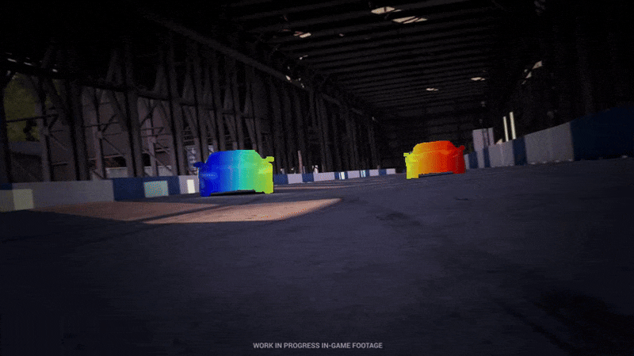

# SPOT
### [Paper](https://arxiv.org/abs/2503.06471) | [Project Page](https://dqiaole.github.io/SPOT/)
> [**Online Dense Point Tracking with Streaming Memory**](https://arxiv.org/abs/2503.06471)            
> Qiaole Dong, Yanwei Fu        
> **ICCV 2025**




## Requirements

```Shell
conda create --name spot python=3.9
conda activate spot
pip install torch==2.2.2 torchvision==0.17.2 torchaudio==2.2.2
pip install flash-attn --no-build-isolation
pip install cupy==12.3.0 pyarrow==11.0.0
pip install tqdm matplotlib einops einshape scipy timm lmdb av mediapy tensorboard numpy
```

## Models
We provide pretrained model under ckpts directory. The default path of the model for evaluation is:
```Shell
├── ckpts
    ├── spot.pth
```

## Demos
Run the following command, you can put any videos under the directory demo_input_images/color and provide an object mask (optional) under demo_input_images/mask:
```shell
python demo.py --ckpt_path ckpts/spot.pth --visualization_modes overlay_mask_stripes --video_path demo_input_images/color --mask_path demo_input_images/mask/00000.png --save_mode image --vis_dir demo_vis
```

## Required Data
To train SPOT, you will need to download the required datasets.

First, download the [CVO](https://github.com/mulns/AccFlow/tree/main/data#cvo-dataset) dataset.
Then, download the [Kubric-MoviF](https://github.com/16lemoing/dot#data-preprocessing-1) train data.

By default our codes will search for the datasets in these locations. You can create symbolic links to wherever the datasets were downloaded in the datasets folder
```Shell
├── datasets
    ├── kubric
        ├── cvo
            ├── cvo_train.lmdb
            ├── cvo_test.lmdb
            ├── cvo_test_extended.lmdb
        ├── movi_f
            ├── video
            ├── ground_truth
```

## Training
```shell
python train_of.py --name raft_cvo_2frame --is_train True --lambda_motion_loss 1.0 --batch_size 2 --train_iter 500000 --gpus 0 1 2 3
python train_of_video.py --name spot --is_train True --lambda_motion_loss 1000.0  --refiner_path ckpts/raft_cvo_2frame_[suffix here]/500000_it.pth --batch_size 8 --train_iter 100000 --gpus 8 --GPU_ids 0,1,2,3,4,5,6,7 --DDP --movif --split extended --height 384 --width 384 --movif_stride 1 --disable_occ_warmup --disable_random_sample --input_frames 24 --mixed_precision
```

## Reference
If you found our paper helpful, please consider citing:
```bibtex
@inproceedings{dong2025online,
  title={Online Dense Point Tracking with Streaming Memory},
  author={Dong, Qiaole and Fu, Yanwei},
  booktitle={Proceedings of the IEEE/CVF International Conference on Computer Vision},
  year={2025}
}
```

## Acknowledgement

Thanks to previous open-sourced repo: 
* [DOT](https://github.com/16lemoing/dot)